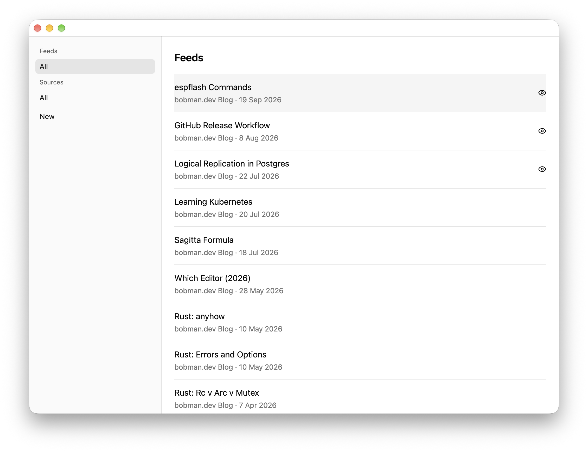

# GPUI RSS

GPUI RSS is a simple RSS viewer application built in Rust with [GPUI
Kit](https://gpui-kit.com). The purpose of this application is to provide an
easy and simple way to view multiple RSS feeds on any desktop device.



## Usage

This application is not a production app. It has not been 'build for release' and has no `.dmg`/`.exe` to run it. If you want to run it you can close the repo, and run it with `cargo`:

```sh
git clone https://github.com/bobbymannino/gpui-rss
```

```sh
cd gpui-rss
```

```sh
cargo run -r
```
